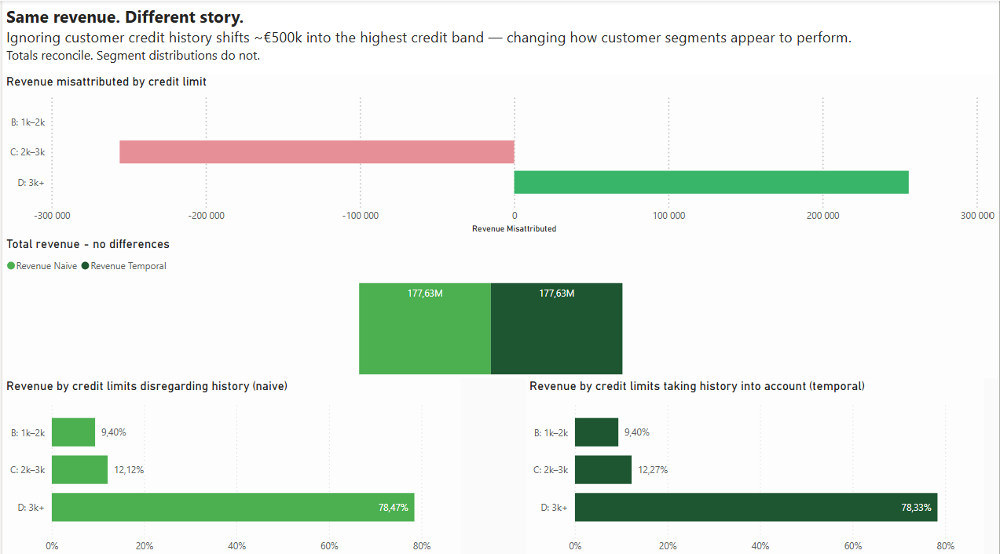
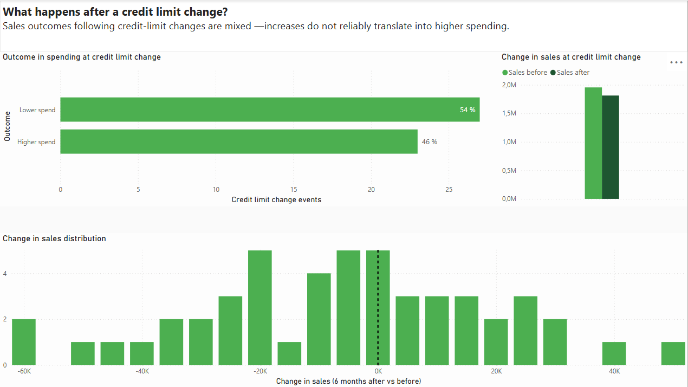
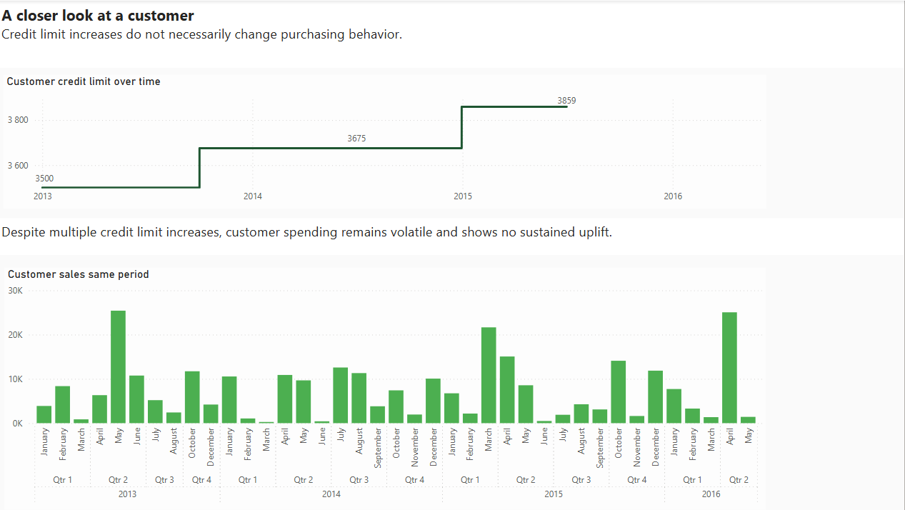

# Same revenue. Different story.

**Ignoring customer credit history can fundamentally distort how customer segments appear to perform — even when total revenue is unchanged.**

This project explores how **Slowly Changing Dimensions (SCD Type 2)** affect customer segmentation and behavioral analysis, using customer credit limits as a real-world example.

> Totals reconcile.  
> Segment distributions do not.

---

## Why this matters

In many BI and analytics setups, customer attributes are treated as *current-state only*.

That shortcut often produces:
- misleading segment performance
- inflated high-tier customer revenue
- incorrect conclusions about customer behavior

This project demonstrates **how much interpretation changes** when customer history is modeled correctly.

---

## Page 1 — Segment distortion

**Same revenue. Different story.**

When customer credit history is ignored, nearly **€500k** of revenue is misattributed to the highest credit band.

Totals still match — but the **story changes completely**.

---

## Page 2 — What happens after a change?

A common assumption is that **higher credit limits lead to higher spending**.

The data does not support that assumption.

- 54% of credit limit increases are followed by *lower* spending
- 46% are followed by higher spending
- Outcomes are volatile and mixed

---

## Page 3 — One customer, over time

To make this concrete, the final page follows a single customer across multiple credit limit changes.

Despite several increases, spending remains volatile with **no sustained uplift**.

---

## Technical approach (high level)

- SQL Server
- Temporal logic / effective dating
- Event-based analysis windows
- Power BI for analytical storytelling

The underlying model uses **historical customer attributes joined to transactional data at the time of the transaction**, rather than current-state attributes.

---

## Code availability

⚠️ **Note on code publication**

The SQL implementation used to generate this dataset is part of an ongoing graded school assignment and cannot be published publicly until the submission window has closed.

Once permitted, this repository will be updated with:
- full SQL scripts
- temporal ETL logic
- schema definitions
- reproducible examples

---

## Why this project exists

This project was built to demonstrate:
- how to build an entire ETL pipeline in SQL including SCD2 dimensions
- (proof-of-concept of ETL code)
- how subtle modeling choices affect business conclusions
- practical handling of Slowly Changing Dimensions
- the ability to turn complex data engineering concepts into clear, business-facing insights

---

*Feedback, questions, and discussion are very welcome.*
